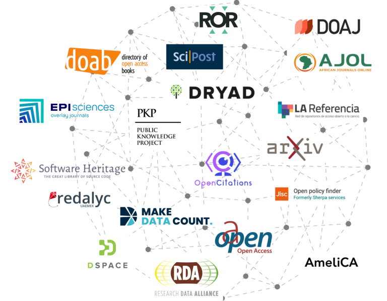

On April 29, 2025 a webinar was held for the 'SCOSS family', which includes the infrastructures that have been selected by the [SCOSS initiative](https://scoss.org/what-is-scoss/scossfamily/), as illustrated below on the date of the webinar:

The agenda was as follows:

> Introduction, Vanessa Proudman 
TSOSI story, ideas and goals, Maxence Larrieu  
TSOSI platform, how does it work?, Guillaume Alzieu  
TSOSI & SciPost approach, Jean-Sebastien Caux  
DOAJ’s experiences of TSOSI, Joanna Ball  
Discussions  

The presentations describe the project's idea and its potential impact on the research community. The slides are shared on Zenodo: [https://doi.org/10.5281/zenodo.15304265](https://doi.org/10.5281/zenodo.15304265). Below are a few key points that were shared by the speakers and participants:

- TSOSI allows us to visualize the pledging landscape and acknowledge the funders.

- It enables users to observe growth, as well as any stagnation or decline in funding.

- One goal is to increase trust in open science infrastructure.

- TSOSI can be used to identify key stakeholders in funding infrastructure, which could facilitate organizing a conference to encourage institutions to join the movement.

- Versioning the API would be beneficial for all users, ensuring they are aware of any changes made.

- How will institutions use the tool?

- How frequently will the data be updated?

- Next to a consortia approach, it would be great to have a "mission group" approach, like the "Association of Research Libraries" (US)

- TSOSI normalize financial contribution to infrastructures

