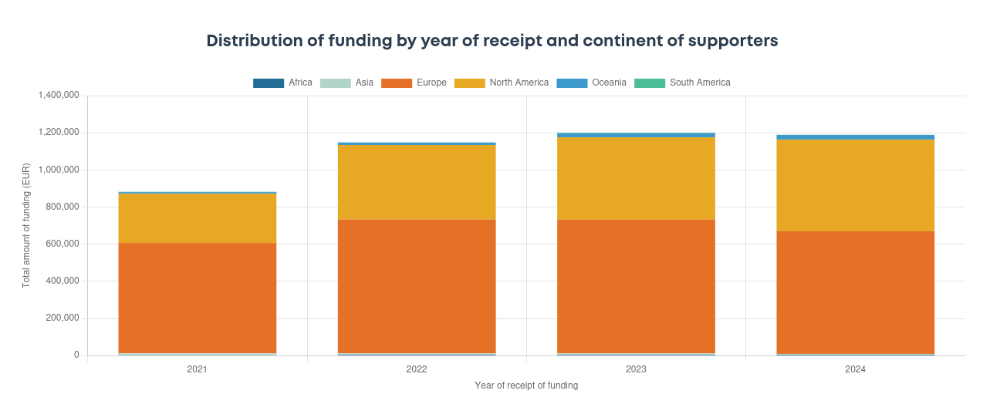
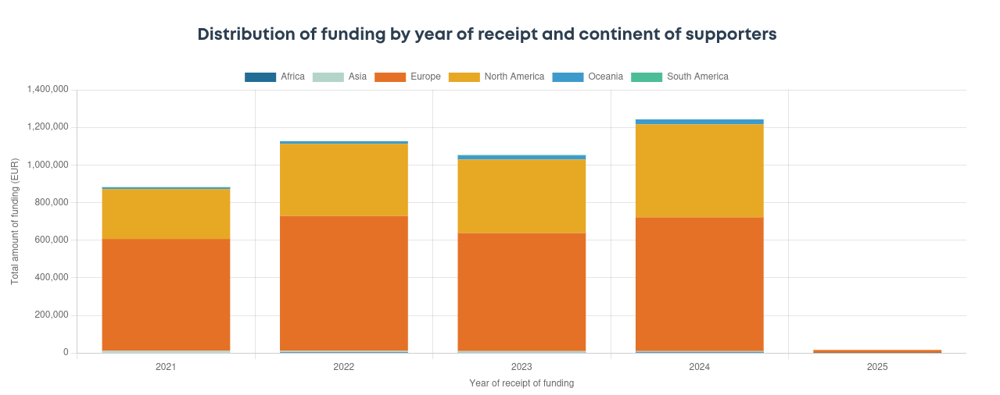

## Original data

This graph presents the Distribution of funding by year of receipt and continent of supporters for the Directory of Open Access Journals, before the data correction.

<!--more-->

## Updated data

This graph presents the Distribution of funding by year of receipt and continent of supporters for the Directory of Open Access Journals, after the Couperin related transfers for years 2023 and 2024 were corrected.

    Some custom HTML.

