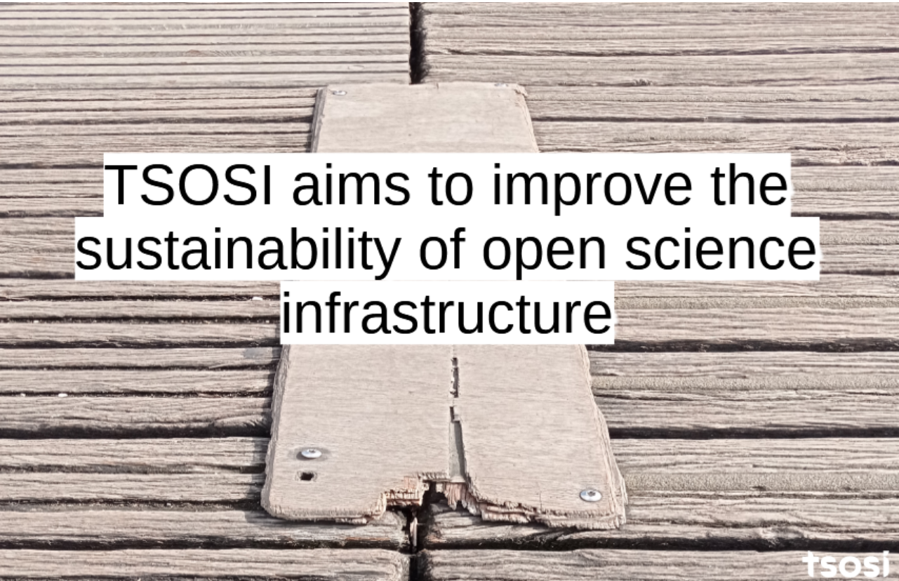
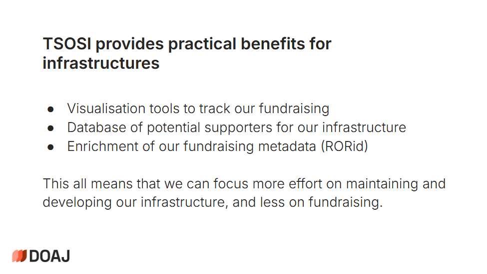

Relive TSOSI's inaugural webinar held in June 2025. 

<!--more-->

You can revisit the recording of the webinar on [YouTube.com](https://www.youtube.com/watch?v=EG9iqUak3kM), and the slides of the presenters are shared on Zenodo [Zenodo](https://doi.org/10.5281/zenodo.15674779).

The public launch webinar in June 2025 brought together a number of speakers involved with TSOSI as project funders, infrastructures and end users, and offered the opportunity to discuss use cases and future plans for TSOSI, and ways the community can contribute to its growth. 

## Setting the scene

The webinar was chaired by **Bianca Kramer**, Executive Director of the [Barcelona Declaration on Open Research Information](https://barcelona-declaration.org). She introduced TSOSI as a platform designed to promote transparency and broaden support for open infrastructures, and emphasized the great value in making financial contributions to open infrastructures visible. 

The opening remarks for the webinar were then delivered by **Marin Dacos** ([French Open Science Committee](https://www.ouvrirlascience.fr/the-committee-for-open-science/)) and **Caroline Bertonèche** ([Université Grenoble Alpes](https://www.univ-grenoble-alpes.fr/)) \- both from organizations that support the development of TSOSI. 

Marin Dacos highlighted that many people use open science infrastructure without knowing that there is an issue of sustainability and cost to it. The [French National Open Science Fund](https://www.ouvrirlascience.fr/national-fund-for-open-science/) supported the development of TSOSI to encourage more institutions to financially contribute to open infrastructures and make them more visible. 

Caroline Bertonèche mentioned how the focus of the TSOSI project on transparency in funding of open science resonated with her at Université Grenoble Alpes. She also emphasized the role of the humanities and social sciences in relation to open science, and the importance of sustainable open infrastructures for academic books. Finally, she reminded the audience of the importance of internationalization and distributed funding of open infrastructures, especially in times of crisis. 

##  Introducing TSOSI

After these introductory remarks, **Maxence Larrieu** and **Guillaume Alzieu** of [GRICAD](https://gricad.univ-grenoble-alpes.fr/en/) described the ideas and goals behind TSOSI and how the _beta_ version of the platform works. Maxence summarized the goal of TSOSI as “to reach sustainability through transparency”  \- by making financial supports to open infrastructures visible, the  hope is to increase the number of supporters and help make funding open science infrastructure the norm. 

Guillaume then showed how at the time of launch, TSOSI was collecting, enriching and displaying data from five infrastructures, in an interactive web platform, as data download and through an API. Data is provided by the infrastructures themselves, and they have the choice to display or not the amount of the financial supports.

## Use cases 

The webinar then continued with four use cases, showing the perspectives on TSOSI of infrastructures and libraries as well as the connection of TSOSI to the wider landscape of organizing funding for open infrastructures. First, **Thomas Guillemaud** of [Peer Community In (PCI)](https://peercommunityin.org/) explained that TSOSI is helping them to tell the story of who is financially supporting PCI, which, in turn, increases transparency and trust in the platform. **Demmy Verbeke** from [KU Leuven](https://bib.kuleuven.be/) reflected on the reasons for KU Leuven to be open about their investments to open infrastructure (transparency, promotion of infrastructures, inspiration for other libraries and visibility) and noted that this is exactly what TSOSI is doing at a larger scale and more objectively. 

**Rosalie Lack** from [SCOSS](https://scoss.org/), emphasized that connected open science infrastructure requires sustainable distributed support, with no single institution, single country and single region of the globe or a single institution carrying the load alone. It is this distributed support that SCOSS is organizing and TSOSI is making visible. Finally, **Joanna Ball** from [DOAJ](https://doaj.org/) explained the need for sustained funding for operations and maintenance (not just funding new developments), the practical benefits of TSOSI for DOAJ, and its importance in making that funding visible, promoting, highlighting and celebrating it. 

## Discussion and next steps

After these presentations, participants and speakers discussed a number of questions and issues. One of the issues discussed was the governance and funding model of TSOSI itself. In its first stage, TSOSI is a project, funded by The French Committee for Open Science with the University Grenoble Alpes as the project leader. TSOSI also has its own governance, with a steering commettee, an advisory group (including  DOAJ, DOAB, OPERAS and SCOSS) and a user group (including PCI, SciPost and Couperin). Long term sustainability needs to be established, and this is also where research organizations might be able to contribute. Technical sustainability is supported by the fact that all data and source code is made openly available. 

Other questions were about the inclusion criteria for infrastructures, where TSOSI is currently taking a pragmatic approach (for instance, collaborating with the [SCOSS family](https://scoss.org/what-is-scoss/scossfamily/) of infrastructures). TSOSI also highlights whether infrastructures have committed to the [Principles of Open Scholarly Infrastructure (POSI)](https://openscholarlyinfrastructure.org/) and are part of [Invest in Open Infrastructure (IOI) InfraFinder](https://infrafinder.investinopen.org/solutions).

A final question was about whether universities and libraries could also provide data to TSOSI about the infrastructures they have supported. In the first phase of the project, TSOSI focused on receiving data from infrastructures, but for a next phase, research organizations might also be considered as a data source. Concretely, TSOSI  plans to work with consortia to collect and ingest new data, as well as with [openCost](https://www.opencost.de/en/), which research organizations can use to make data on funding transparent. 

The webinar provided participants with an introduction to TSOSI, and a clear demonstration of the value of TSOSI to both open infrastructures and the research organizations that support them. 

The webinar presentations can be viewed on YouTube [https://www.youtube.com/watch?v=EG9iqUak3kM](https://www.youtube.com/watch?v=EG9iqUak3kM) and the slides are shared on Zenodo [https://doi.org/10.5281/zenodo.15674779](https://doi.org/10.5281/zenodo.15674779). 

