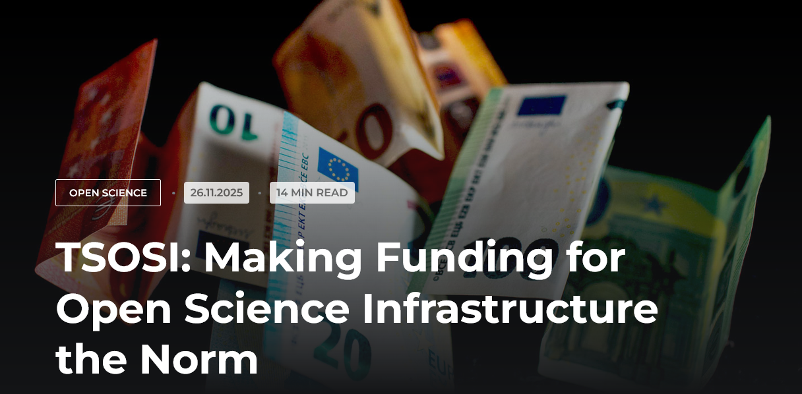

The ZBW Open Science Blog has published [a new post about TSOSI](https://www.zbw-mediatalk.eu/2025/11/tsosi-making-funding-for-open-science-infrastructure-the-norm/)!

<!--more-->

It starts by explaining the context of TSOSI, with initiatives such as the ["2.5% Commitment"](http://doi.org/10.7912/C2JD29) (2017) and the SCOSS report ["Scoping the Open Science Infrastructure Landscape in Europ"](http://doi.org/10.7912/C2JD29) (2020).

To illustrate what TSOSI is, we briefly compared it to OpenAPC, the German initiative from the Bielefield University. It might sound strange for some readers, because, of course, paying APC (Article Processing Charges) has nothing in common with paying open infrastructures. The basic of this comparison is that both OpenAPC and TSOSI are web solutions to practice open data. And OpenAPC is widely known, especially in the academic library field. It started in 2014 and contains currently data from more than 400 institutions, mainly located in Europe (see the Github repository). This short comparison with OpenAPC led us to a new idea of a slogan for TSOSI: stop paying APC, support open infrastructures! In fact, TSOSI will reach its goal once supporting open infrastructures will be as evident, or natural, as paying APC.

We then bring another idea about the visibility of open infrastructures. Near 2015, it was said that infrastructures were invisible, and that only when they break, they become visible – see for example the [blog post introducing the Principle of Open Scholarly Infrastructure (2015)](https://cameronneylon.net/blog/principles-for-open-scholarly-infrastructures/)). We think that to get more supporters, and increase their financial health, open infrastructures need to be visible (without being broken!):

> TSOSI aims to bring support for open infrastructures to the forefront so that every research stakeholder is accustomed to engaging with,
supporting, and communicating their interactions with open infrastructures.

To be supported, the infrastructures have to be known, and we think that the wider they are, the best it is. Research staff needs to communicate to researchers about the importance of the open infrastructures, and vice-versa. It’s something that can be seen on the recent campaign of [SciPost](https://scipost.org), for example, where researchers are invited to write to research staff within their institution.

We finish the post by answering “what’s next?”. Of course, what TSOSI needs is new infrastructures to be part of the network we have started to shape. So once again, if you represent an infrastructure, feel free to contact us to be part of this exciting adventure ([#contact-us](https://tsosi.org/pages/faq#contact-us)). On the other hand, the main goal of 2026, is to welcome data directly from institutions, like OpenAPC. It is a challenge, because we don’t want one financial support to be counted twice. Therefore, a tool will be designed to allow the user to curate their data. This is also the place to welcome your institution, feel free to [contact us](https://tsosi.org/pages/faq#contact-us).

