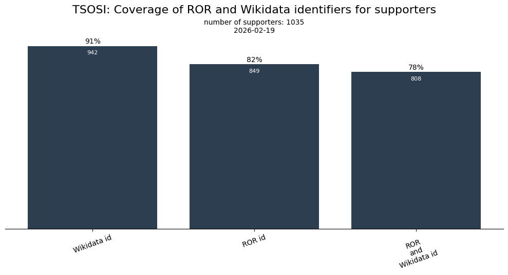
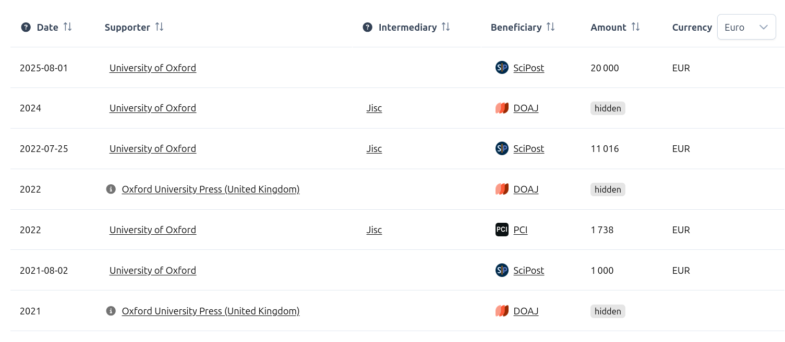
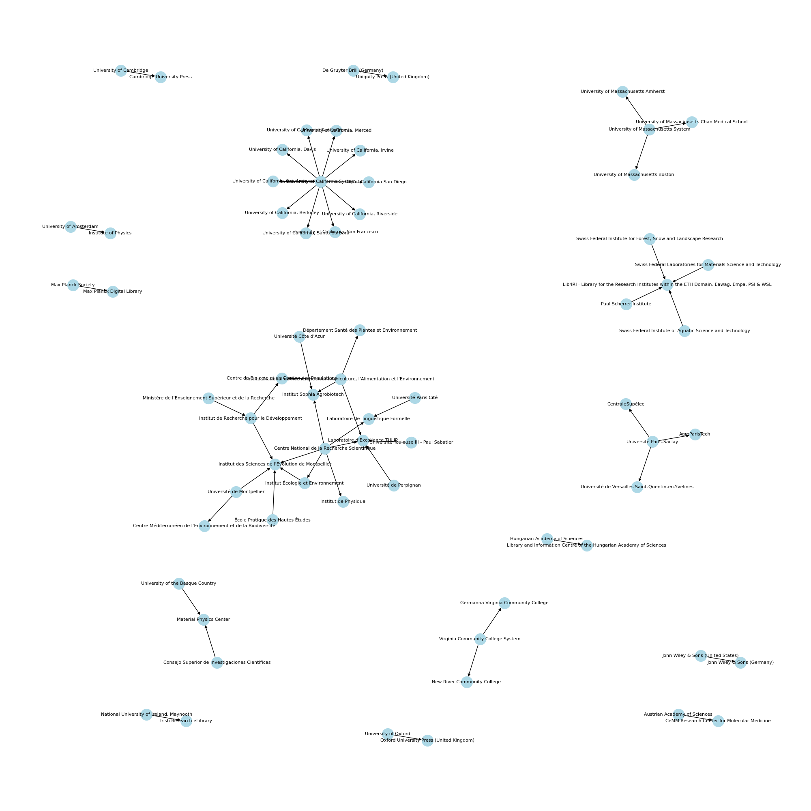

TSOSI has integrated the parent-child relationship from the Research Organization Registry (ROR)! This allows to better represent the organizational structures involved. If a support is done from an organization that is a "child" from another one, then the support also appears on the parent organization.

<!--more-->

### Persistent Identifiers coverage

As of February 2026, TSOSI has gathered the data from 1,036 organizations in 47 countries that have financially supported open infrastructures. The graph below shows the coverage of the two main persistent identifiers used in TSOSI, that is ROR and Wikidata.

ROR and Wikidata identifiers allow us to highlight organizations with specific metadata, like Wikipeda description, website, logos, geographical location, and, now, hierarchical relationships!

### How is it shown? 

If a support is done by an organization that is the "child" from another one, then we _also_ display it on the "parent" organization, with a dedicated icon to inform the user. 

A good example is the [University of Oxford](https://tsosi.org/entities/052gg0110), as shown below, that also contains support from the [Oxford University Press](https://tsosi.org/entities/0336mm561).
 
 

*List of financial supports made by Oxford University Press to Open Science infrastructures*

    

### What has changed?

So far, ROR lists over 17,000 parent-child relationship instances across its registry of more than 116,000 organizations (see [their blog post](https://ror.org/blog/2023-02-27-parents-children-and-other-relationships-in-ror/)). We have added the ones that are part of TSOSI: 59 relationships between 67 institutions have been integrated, which is shown in the graph below (you can click to zoom)

    

  

*Graph of relationships between institutions in TSOSI (Click to zoom)*

### What's next ?

This integration of ROR hierarchies contributes to a better understanding of the open infrastructure support landscape. Taking it further, we could also consider, for organizations without a ROR identifier, the hierarchical relationships present in Wikidata (the property [part of](https://www.wikidata.org/wiki/Property:P361)). 

Similarly, we also plan to integrate the [ROR metadata _type_](https://ror.readme.io/docs/ror-data-structure#types), which can, then, be used to filter on a specific type of supporters, such as funders, company, or government.