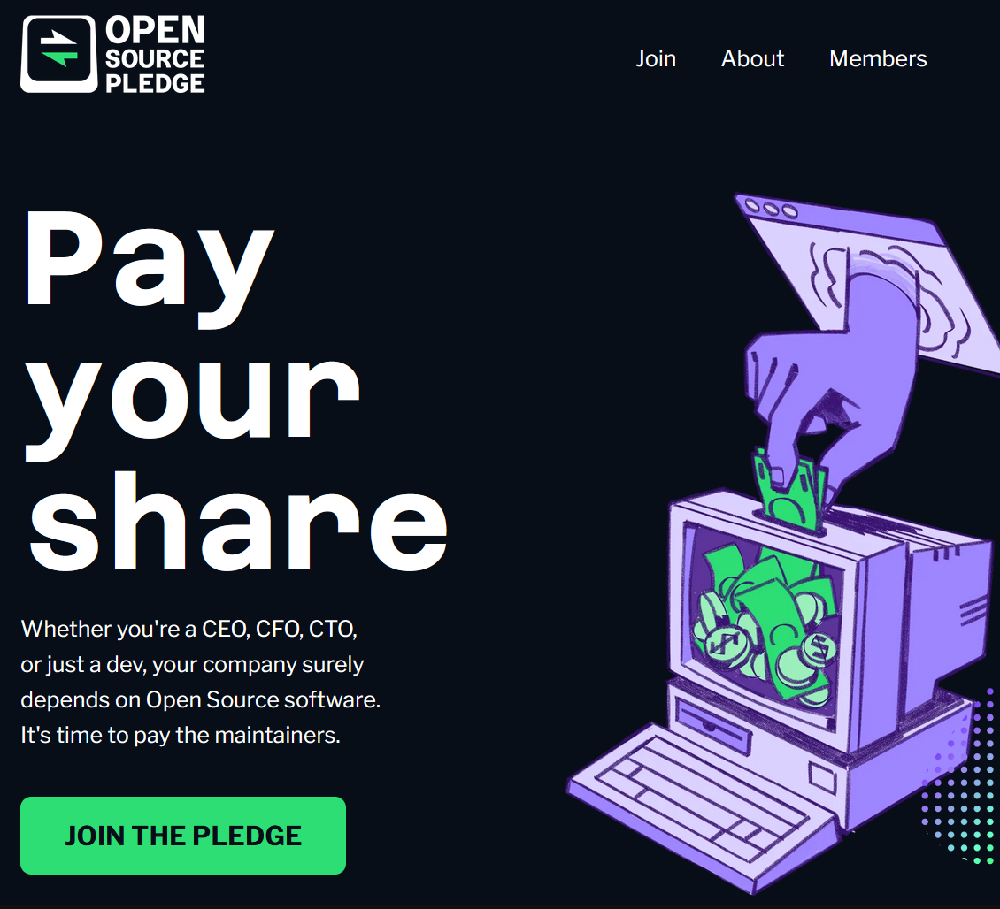
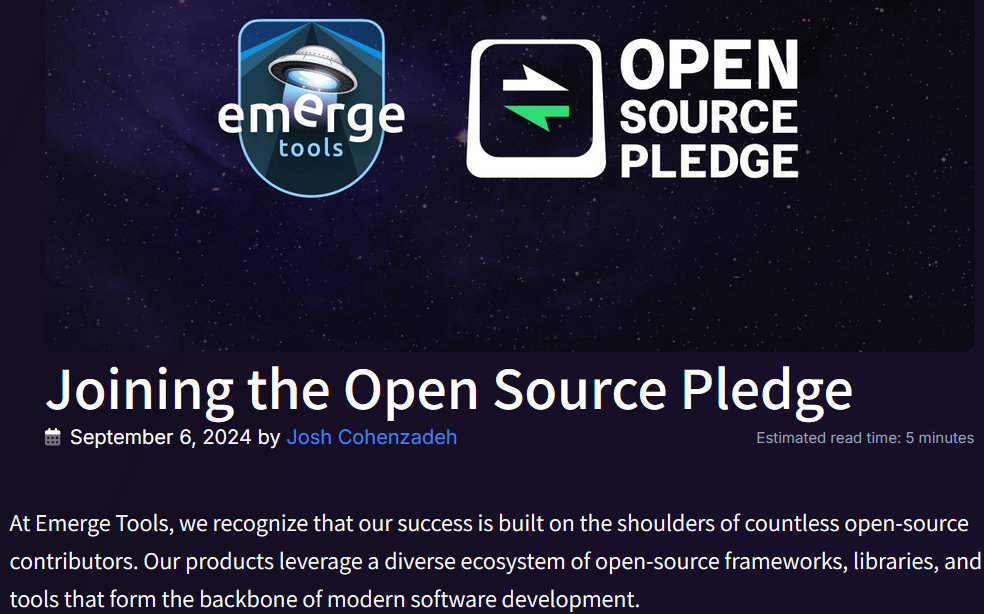
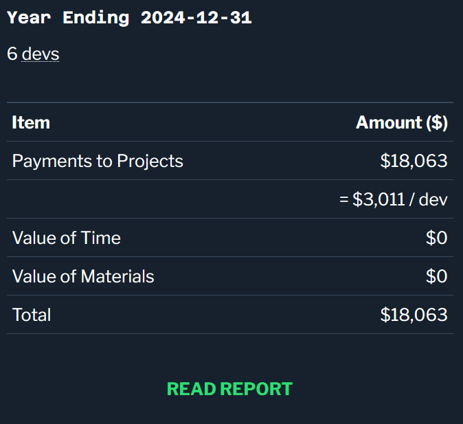
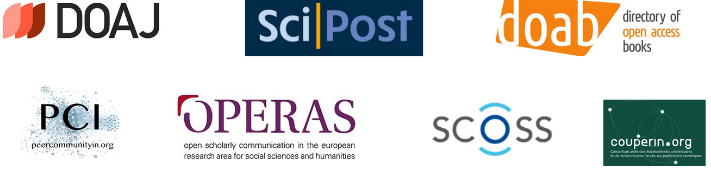

## Transparency to Sustain Open Science Infrastructure

_Introducing by example_

  

<!-- slide -->

## Do you know **Open Source Pledge?**

<!-- sub-slide -->

## Open Source Pledge's goal 

 

to encourage companies to financially commit to Open Source. We all benefit from the vast Open Source ecosystem, and it's time we pay it forward.

<!-- sub-slide -->

## How it works?

1. **Pay** $2,000 per developer on staff to any open source maintainers

2. **Spread** to the world: publish a blog post detailing the contributions your company has made to the Open Source ecosystem in the past year

3. **Donation as data**: share data describing your donation, to appear in the Open Source Pledge Website

<!-- sub-slide -->

Blogpost example

Donation as data

<!-- slide -->

## Transparency to Sustain Open Science Infrastructure

 

_in brief_

<!-- sub-slide -->

## Goal

 

To contribute to the sustainability of open science infrastructure, that is softwares, platforms, standards, protocols, services that allow scholarly stakeholders to practise, develop and observe open science.

Some essential open science infrastructure are: OpenCitation, SoftwareHeritage, Zenodo, ArXiv, PKP, Dataverse, DOAJ, ROR etc.

<!-- sub-slide -->

## How it works? 

 

1. We get all funding data from a selection of open science infrastructure

2. We structure these data and add persistent identifiers

3. We build a website to allow users to explore all these fundings

<!-- sub-slide -->

### How building a website with funding data will contribute to the sustainability?

 

The website will shine the spotlight on open science funders, so that other organisations can follow suit.

Mimicry is powerful: if they do it, we should do it.

<!-- sub-slide -->

### Who are the funders of Open Science Infrastructure?

 

The project is worldwide, so funders are very diverse. It can be any stakeholder related to the research ecosystem: 

government, university, research funder, grant organisation, private companies, research library or laboratory...

<!-- sub-slide -->

### Who are the Open Science Infrastructure for the project launch? 

 

 Since March 2024 we are pleased to work with: 

 and we'd love to include other

<!-- sub-slide -->

### How to reach you? 

 

contact`[the at symbol]`tsosi.org