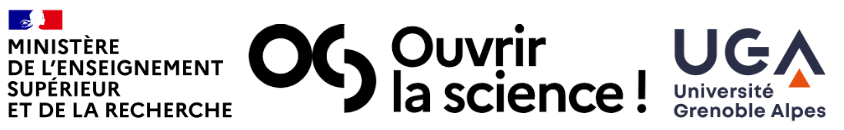
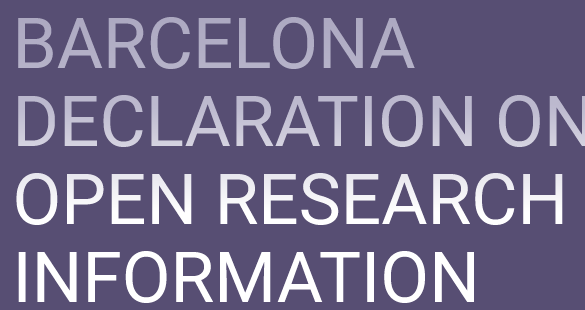
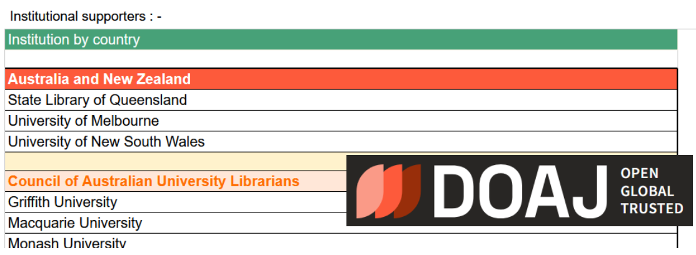
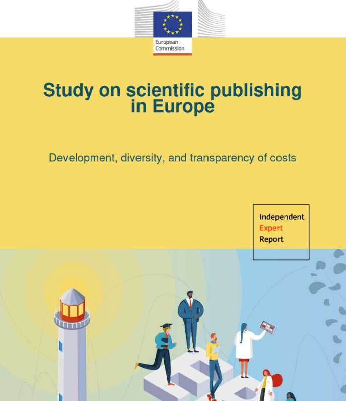
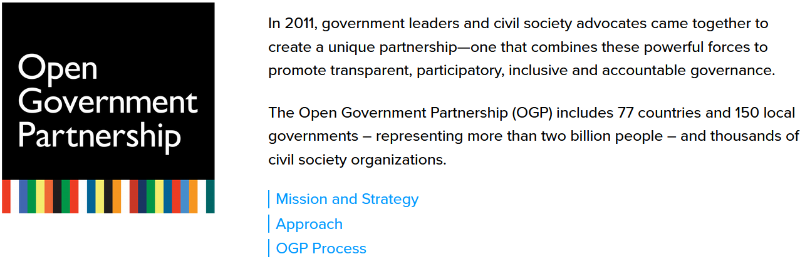
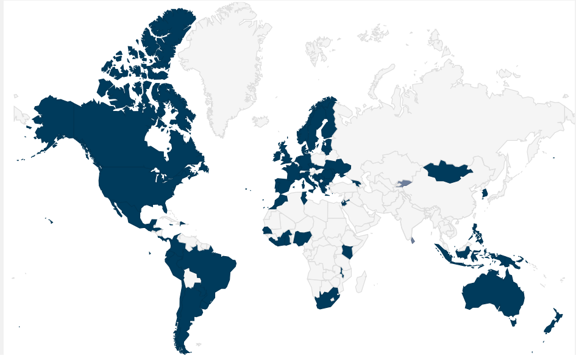
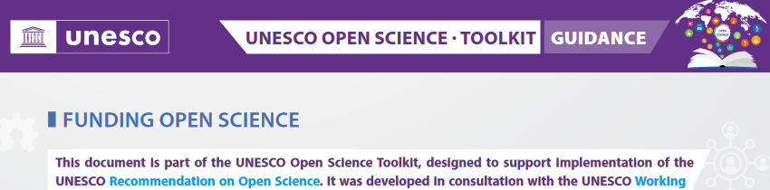
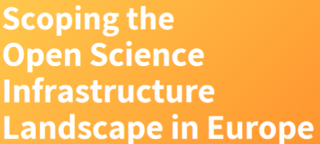

## Transparency to Sustain Open Science Infrastructure

<!-- sub-slide -->

## Maxence Larrieu

 

- 2018 PhD graduate
- woking for open science since 2015
- working at Université Grenoble Alpes since 2023
- TSOSI project manager

<!-- sub-slide -->

## Guillaume Alzieu

- 2023, dev for a Diamond open access platform: Centre Mersenne
- 2024-09, TSOSI Data & web ingeneering

<!-- slide -->

TSOSI

_main pitch_

<!-- sub-slide -->

Research relies on open infrastructure that are recent (< 30 years). The financing of this infrastructure is not stabilized and is a crucial issue.

<!-- stabilized -->

<!-- sub-slide -->

For example, the _Declaration of Barcelona_ (2024) invites signatories to fund infrastructure ([3rd commitment](https://barcelona-declaration.org/commitments/))

<!-- sub-slide -->

TSOSI aims to contribute to the sustainability of the open science infrastructure

<!-- sub-slide -->

- What does TSOSI want to change? the visibility of funds depends on the websites of the stakeholders

- We want to do more than text and logos to thank open science funders

<!-- sub-slide -->

We are building a tool to enhance the value of all those institutions and entities that fund open science infrastructure

  

  For (national) funders and institutions/consortia, to make complete information available on all investments in open access initiatives in a standardised way, _e.g._ on the organisation’s website, **and ideally centrally collect this information**

  

  

<!-- sub-slide -->

The more we <strong>enhance the value</strong> of this funding, the more <strong>common</strong> they will become

<!-- sub-slide -->

- We want open science funding to **become the norm**: it should be as easy to support open science as it is to purchase commercial content

- **Transparency builds trust**. By making funds publicly available, we aim to improve the trust that stakeholders have in open infrastructure

<!-- slide -->

TSOSI

_as a service_

<!-- sub-slide -->

- TSOSI collect data on funding received by open science infrastructure

- It will be a means to objectify funding made in favor of open science

- TSOSI will contribute to the <strong>transparency</strong> of these infrastructure, enhancing  stakeholders' <strong>trust</strong>

<!-- sub-slide -->

## A service for Open Science Infrastructure

- Let's forget tables and manual editing within websites

- As with OpenAPC, TSOSI will permit to integrate datavisualisation in other websites

- Enhance visibility: the user will be able to discover & compare infrastructure

<!-- sub-slide -->

## A service for research institutions

- Allows research institution to objectify where they have invested

- Data and visualization will be easily integrated into other websites

- Allows to compare where peers are investing, helping the decision making process

<!-- sub-slide -->

## A service for the research community

- An answer to the famous question "who pays when it's open?"

- Explore the various economic models of infrastructure

- Explore the funding trends

<!-- slide -->

TSOSI

_it's all about open data_

<!-- sub-slide -->

## TSOSI

- Centrally collects funding received by the infrastructures

- Structures & enriches data with persistent identifiers (ROR, Wikidata)

- Makes structured data openly available thanks to an Open API

<!-- sub-slide -->

<!-- .slide: data-background-iframe="https://treemaps.openapc.net/apcdata/openapc/" data-background-interactive="False" -->

## <strong style="background-color: white;color:black">Do you know OpenAPC?</strong>

<!-- sub-slide -->

## OpenAPC

- Centrally collects APCs paid by the author's institution for publishing

- Enriches data with persistent identifiers (ISSN, ISBN, DOAJ )

- Makes structured data openly available thanks to an Open API 

<!-- sub-slide -->

### TSOSI, as OpenAPC, is about open data

But of course, projects are different ...

- OpenAPC data comes from research institutions, while TSOSI data comes from infrastructure

- plus, the big difference between paying APCs versus funding open science infrastructure

_That's why it's best to compare TSOSI with Open Source Pledge_

<!-- sub-slide -->

## Open Government Partnership

<!-- sub-slide -->

#### More than 70 national members!

<!--  -->
<!-- .slide: data-slide-id="slide-opengov-geochart" -->


<!-- sub-slide -->

TSOSI relies on open data movement and policies, at all levels 1, to make it's data openly available

1 Non-governmental organization, United nation, government, consortium, assocation, institution, citizen...

<!-- slide -->

TSOSI

_Other related initiatives_

<!-- sub-slide -->

<!-- .slide: data-background="scoss-back.png" -->

Global Sustainability Coalition for Open Science Services

<!-- sub-slide -->

## SCOSS

  launched in 2017

  Netherlands

  [scoss.org](https://scoss.org/)

> Our purpose is to help identify non-commercial services essential to Open Science, and to make qualified recommendations on which of these services should be considered for funding support

<!-- sub-slide -->

<!-- .slide: data-background="investinopen-back.png" -->

Invest in Open Infrastruture

<!-- sub-slide -->

## Invest in Open Infrastruture

  launched in 2019

  United States

  [investinopen.org](https://investinopen.org/)

> Our mission is to drive informed, strategic, and coordinated investment in and adoption of open infrastructure

<!-- sub-slide -->

> We will support the sustainability of infrastructures for open research information

 2024 · [barcelona-declaration.org](https://barcelona-declaration.org/) 

<!-- sub-slide -->

> Governments, funders and relevant institutions are encouraged to: Commit to providing the funding required to operationalize open science

2022 · https://doi.org/10.54677/MGVX2222

<!-- sub-slide -->

> We see a diverse, interconnected, open, professional and viable, developing OS ecosystem in Europe on solid ground; one that is worth investing in. 

2020 · https://doi.org/10.5281/zenodo.4159838 

<!-- sub-slide -->

## and more ... 

- David W. Lewis [2.5 commitment](https://digitalcommons.unl.edu/scholcom/83/?utm_source=digitalcommons.unl.edu%2Fscholcom%2F83&utm_medium=PDF&utm_campaign=PDFCoverPages) (2017)

- Michael Roy [1% for Open](https://docs.google.com/document/d/1JJKvciLGV_kTcJtT3xHH_2Keig8z0sWw64pk6T4SBJ0/edit#heading=h.4lr3bebtwqqc) (2017)

- Knowledge Exchange repport [Putting down roots Securing the future of open access policies](https://repository.jisc.ac.uk/6269/10/final-KE-Report-V5.1-20JAN2016.pdf) (2016)

