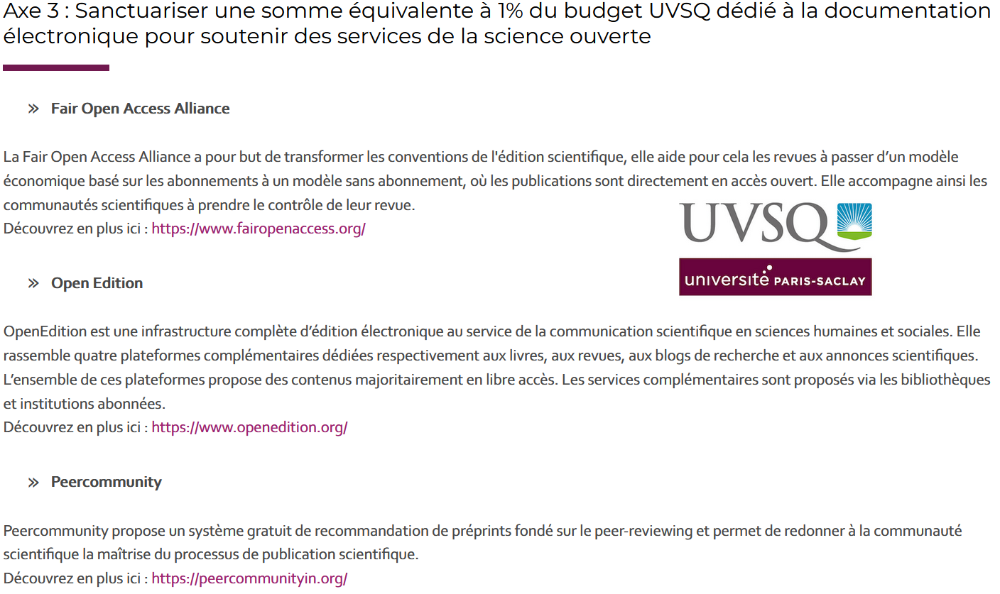
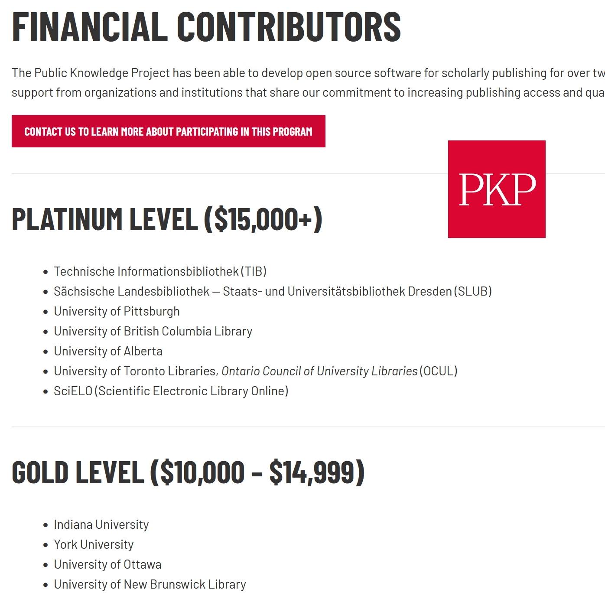
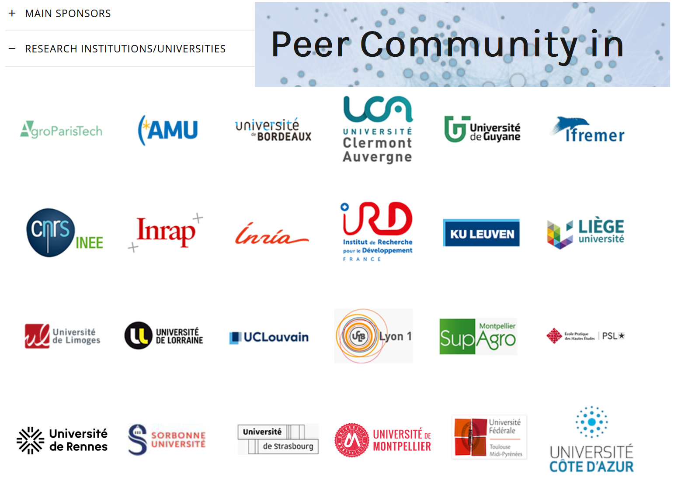
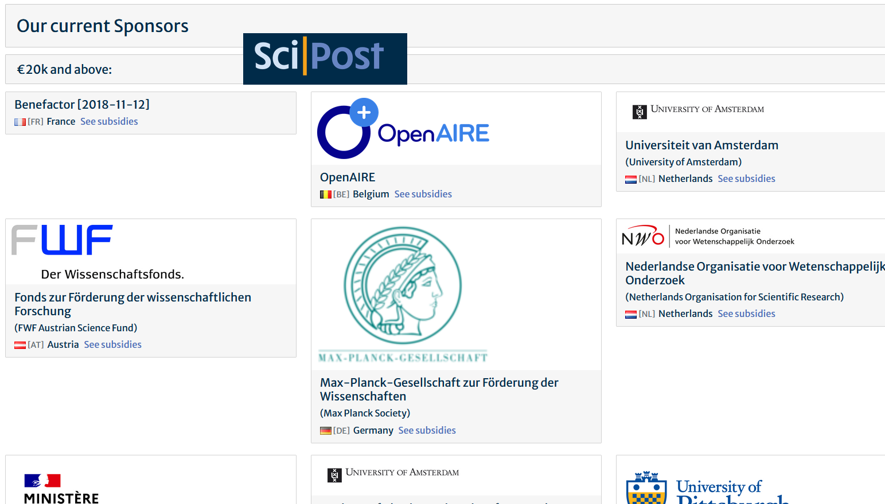
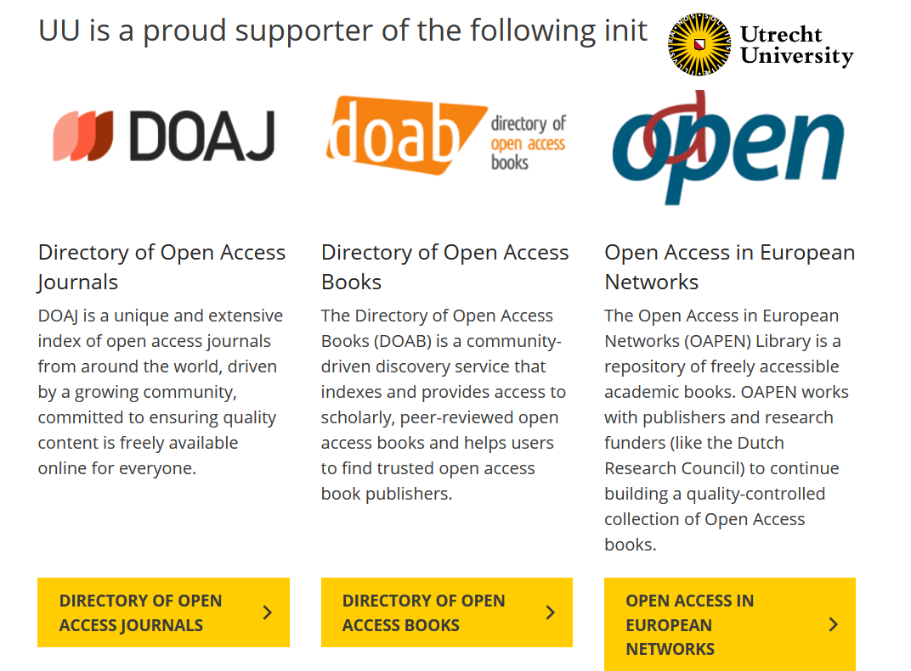
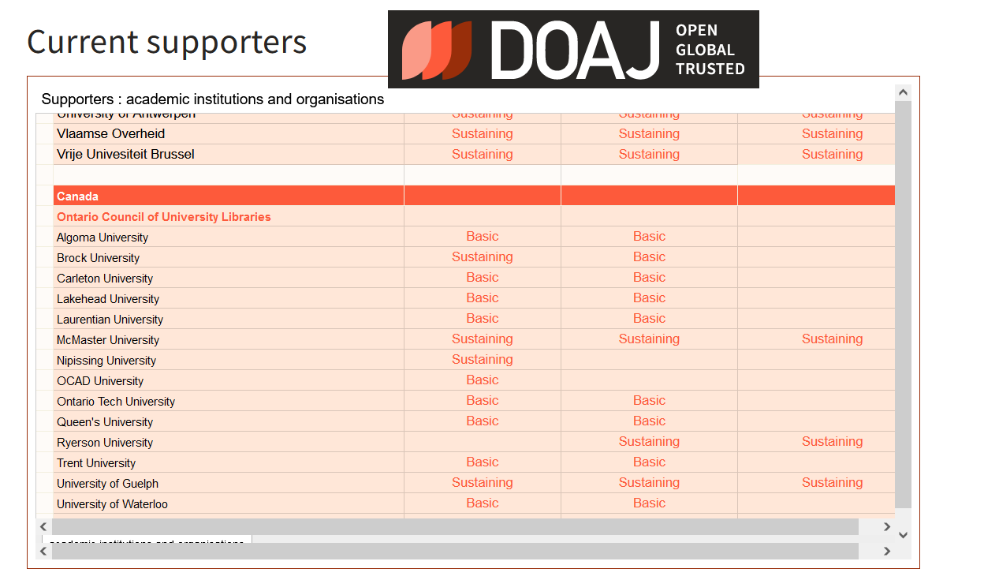
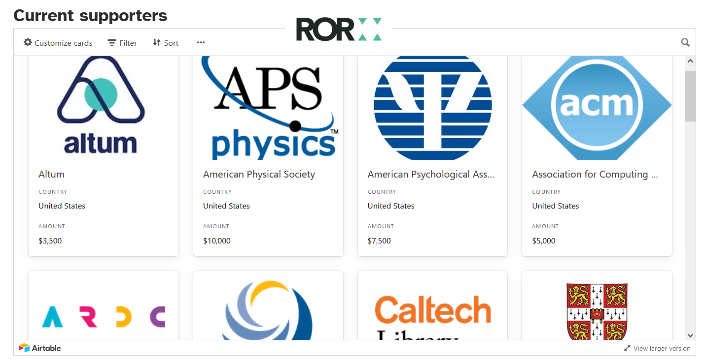

## Transparency to Sustain Open Science Infrastructure

 

Maxence Larrieu, PhD  

`2023-09-01`

<!-- slide -->

## Background
(i)

<!-- sub-slide -->

The research relies on open infrastructures that are recent (< 30 years). The financing of these infrastructures is not stabilized and is a crucial issue. 

<!-- sub-slide -->

The actors of the research ecosystem must invent ways to support it.

"Governments, funders and  relevant  institutions are encouraged to: Commit  to  providing  the  funding  required  to  operationalize open science"

"by increasing funding for open science infrastructures and services"

UNESCO, 2022, [Funding open science](https://unesdoc.unesco.org/notice?id=p%3A%3Ausmarcdef_0000383709&posInSet=6&queryId=N-EXPLORE-8e161eb1-7b01-4506-b255-ba7d6a7f5780)

<!-- sub-slide -->
### Specificity of the open infrastructures

 
they are financed without getting anything personalized in return, we pay for the support of a common good

<!-- sub-slide -->

### Related events

* [Investments in open](https://www.arl.org/resources/investments-in-open-association-of-research-libraries-us-university-member-expenditures-on-services-collections-staff-and-infrastructure-in-support-of-open-scholarship/) (ARL report, 2022)
* [Scoping the Open Science Infrastructure Landscape in Europe](https://doi.org/10.5281/zenodo.4159838)(2020)
* [Invest in open infrastructure](https://investinopen.org/about/) (2018)
* David W. Lewis _[2.5 commitment](https://digitalcommons.unl.edu/scholcom/83/?utm_source=digitalcommons.unl.edu%2Fscholcom%2F83&utm_medium=PDF&utm_campaign=PDFCoverPages)_ (2017)
* [Global Sustainability Coalition for Open Science Services](https://scoss.org/what-is-scoss/past-scoss-awardees/) (2017)
* Michael Roy [1% for Open](https://docs.google.com/document/d/1JJKvciLGV_kTcJtT3xHH_2Keig8z0sWw64pk6T4SBJ0/edit#heading=h.4lr3bebtwqqc) (2017)
* Knowledge Exchange repport _[Putting down roots Securing the future of open access policies](https://repository.jisc.ac.uk/6269/10/final-KE-Report-V5.1-20JAN2016.pdf)_ (2016)

<!-- sub-slide -->

### Key stakeholder

* **Open Infrastructures** : initiatives/organisations/services which contribute to open science (content & metadatas) on the web (DataCite, PKP, OpenCitation ...) [1]

* **Research Institutions** : institutions where the research takes place

<!-- sub-slide -->

[1] A rational on the perimeter and the naming will be necessary : 

* "Open scholarly infrastructure" ([POSI](https://openscholarlyinfrastructure.org/faq/))
* "Open infrastructure" ([SCOSS](https://scoss.org/what-is-scoss/defining-open-infrastructure/), [IOI](https://investinopen.org/about/))
* "Open research infrastructures"
* "Open science infrastructures" (SparcEurope, UNESCO)

<!-- slide -->

<!-- memo speaker
 you will know see some eexample -->

## How funds are currently displayed ? 
(ii)

<!-- sub-slide -->

### Focus on the level involved with institutions & Open infrastructures

<!-- sub-slide -->

<!-- sub-slide -->

<!-- sub-slide -->

<!-- sub-slide -->

<!-- sub-slide -->

<!-- sub-slide -->

<!-- sub-slide -->

<!-- slide -->

## Limits
(iii)

<!-- sub-slide -->

* Funds are poorly valued, sometimes actors simply forget

* The visibility of funds depends on the websites of the actors

* Crucial data is missing : time, amount and PIDs (persistent identifiers)

<!-- sub-slide -->

The funds are displayed by HTML and logos information.

TSOI goal is to represent them with open and structured data (**ROR**, **wikidata**) in a dedicated and interoperable tool

<!-- sub-slide -->

> "The way we fund and resource open projects we rely on is insufficient" 

[Invest In Open](https://investinopen.org/about/)

 
 

<!-- sub-slide -->

Funding for open infrastructures is not visible globally

* lack of transparency
* lack of coordination
* the big picture isn't possible

<!-- slide -->

## Towards a solution
(iv)

<!-- sub-slide -->

We aim to **valorize** the funding.

The more we value these funding the more common they will become. 

<!-- sub-slide -->
### How to valorize ? 

   
* In making **publicly available** the funding made from Research institution to open infrastructures 

* We **mimic**: if they do it we should do it
<!-- sub-slide -->

### TSOI, an added value for funding

   
Add value on funding, so that others will want to fund

<!-- sub-slide -->
### draft : we are in a transition

* from acquiring to funding
* buy ≠ fund
* we have been used to hiding the price of acquisitions (hiden subscription contrats )
* TSOI will promote funding for the Open Infra.

<!-- slide -->

## Comparison
(v)

<!-- sub-slide -->

OpenAPC : open the cost of APCs

 (`"authors" ⟷ publishers`)

  
TSOI : open the funding of the open infrastructures

(`institutions ⟷ open infrastructures`)

<!-- sub-slide -->

[ESAC](https://esac-initiative.org/about/about-esac/), [Enquete Couperin 2020](https://www.ouvrirlascience.fr/publication-de-lenquete-sur-les-ressources-electroniques-de-lesri-ere/) ...

A la lumière des efforts effectués pour ouvrir les coûts impliqués par le système éditorial traditionnel, on devine l'importance, les enjeux, liés à l'ouverture des financements effectués pour les infrastructures ouverte.

<!-- slide -->

## TSOI as a service
(vi)

<!-- sub-slide -->

### For research institutions

* TSOI adds value to your institution by making all your funds openly available: "no more manual updates on your website"

* Compare, understand where your peers are investing

<!-- sub-slide -->

### For open infrastructures

* Forget tables, logos and name changes: "focus on your service, we showcase your funders"
* Improve transparency (POSI)

* Compare, understand other economic models

<!-- sub-slide -->

### For the community & society

* An answer to the famous question "who pays ?" (OA is free myth)
* Explore the diversity of economic models
* Explore the tendancy of funding

<!-- slide -->

## extra

<!-- sub-slide -->

* [Open Governmentship](https://www.opengovpartnership.org/about/)
* [The Principles of Open Scholarly Infrastructure](http://openscholarlyinfrastructure.org/)